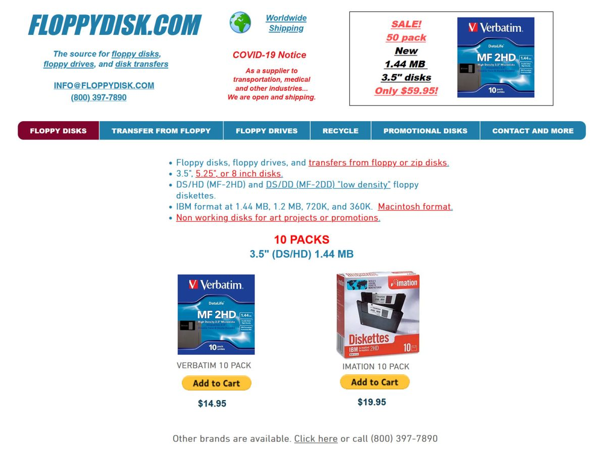

# Бизнес на дискетах: необычная история компании, которая продает дискеты клиентам в 2022 году

Дискеты — технологический артефакт прошлого, о котором очень мало знают многие представители нового поколения. Те же дети, разбирая иконки в каком-нибудь текстовом редакторе, частенько задают вопрос о том, что представляет собой этот странный квадратик. Понемногу иконка дискеты уходит из употребления и дизайнерами различных приложений — просто потому, что все меньше людей может связать иконку и функцию, которая к ней привязана

Но дискеты все же не умерли, они еще используются во многих странах, хотя и не в том объеме, что раньше. Здесь же, на Хабре, публиковалась история о том, что в Японии правительство вынуждено отказаться от дискет в пользу более новых носителей информации. Но «флопики» все же еще в ходу, а значит, их кто-то продает. Это, в основном, мелкий бизнес, но есть и относительно крупная компания, которая предлагает своим покупателям как новые, так и б/у дискеты с гарантией работоспособности. По прогнозам владельца бизнеса, компания продержится еще примерно 4 года — а дальше уже совсем все. Подробности о компании и самих дискетах — под катом.

*Что это за компания*

Называется она floppydisk, не супер-оригинально, зато понятно, чем занимается. К сожалению, она не производит гибкие диски, а перепродает их — закупает на складах разных компаний, у частных владельцев и т.п. Новые дискеты проверяет, форматирует и продает. Старые — тоже проверяет, форматирует, меняет старую использованную наклейку на новую и тоже продает.

Вроде бы последней компанией, которая производила гибкие диски, была Sony, она закрыла все производственные линии этого направления, еще 10 лет назад. А вот floppydisk к тому времени смог накопить солидные запасы гибких дисков — на складах хранилось около 2 млн дискет. Со временем их распродали (продолжая при этом закупать и мелкие партии из разных стран мира). Сейчас осталось всего 500 тыс., которые тоже планируется продать в ближайшее время.

